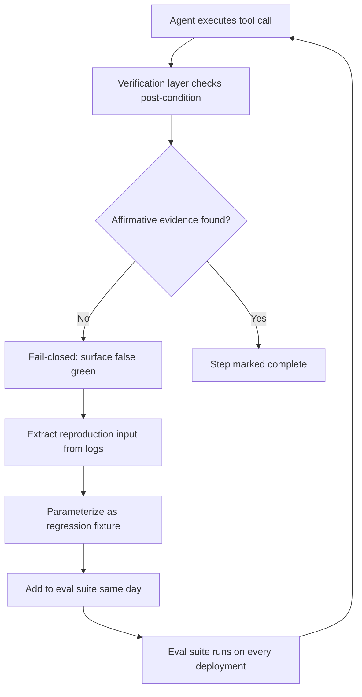

> Part of the series: [Six False-Greens: Field Notes from a Self-Auditing Agent Pipeline](/blog/six-false-greens-in-a-self-auditing-agent-pipeline)

# False Greens: Three Structural Observations

Six times in my autonomous dev-loop, an agent reported success when nothing had actually happened. The pipeline didn't catch them by luck — it caught them because of three structural decisions that compound on each other.

I want to be precise about what "false green" means in this context: not a test that was poorly written, not a flaky integration, but an agent that actively returned a success signal — exit code zero, a confirmation string, a completed-task marker — when the underlying action either failed silently, never ran, or produced output that vanished into a headless void. These are the lies that kill autonomous pipelines, because they look identical to real success at every downstream step. A permissive system swallows them. Mine didn't, and the reason is structural, not lucky.

## The Failure Mode Nobody Talks About

Most agent reliability writing focuses on hallucination — the model says something factually wrong. That's a real problem, but it's not the one that nearly broke my fleet. The failure mode that matters in headless, autonomous execution is something quieter: the agent completes its reasoning trace, emits a success token, and the pipeline moves on. No error. No stack trace. No retry. Just a downstream task that operates on a foundation that was never actually laid.

I call these false greens because they register as passing on every surface you'd check first. The agent's output looks right. The exit signal looks right. The log line looks right. You only discover the lie when something much later in the dependency chain fails in a way that's three hops removed from the actual cause.

In a human team, false greens get caught because a colleague opens the artifact, runs the downstream step themselves, or notices something smells off in review. In a headless agent fleet, none of those affordances exist. The agent doesn't have a human looking over its shoulder. It doesn't have a REPL to check interactively. It has exactly what you gave it: a task spec, a tool set, and whatever verification logic you wired in before it ran.

## Observation One: Fail-Closed Is What Makes False Greens Catchable

Every catch above happened because *something* refused to interpret absence or ambiguity as success. The verify step, the strict parser, the explicit STOP.

This sounds obvious until you trace through how permissive defaults accumulate. A subprocess call that doesn't check return codes. A parser that treats a missing key as null rather than raising. A completion check that looks for the presence of an output file but doesn't validate its contents. Each of these is a micro-optimism — a small bet that silence means success. Stack enough micro-optimisms and you have a pipeline that is structurally incapable of surfacing false greens.

Fail-closed means inverting that default at every boundary. The verify step does not assume the prior step succeeded unless it can produce affirmative evidence. The parser raises on missing required fields rather than coercing them. The STOP condition in the agent loop requires a structured confirmation token, not just the absence of an error. The whole system is oriented around the question: *what would I need to see to be certain this succeeded?* — not *what would I need to see to suspect it failed?*

The practical implementation in my fleet is a verification layer that runs after every consequential tool call. It doesn't re-run the tool; it independently checks the post-condition. If the tool was supposed to write a file, the verifier checks that the file exists, has nonzero size, and matches the expected schema. If the tool was supposed to call an API, the verifier queries the state that the API should have modified. The verification logic is separate from the execution logic, written defensively, and its default return value is failure — not success.

This is the hardest cultural shift in building autonomous systems: you have to treat your own pipeline with the same skepticism you'd apply to an untrusted external service. The agent is not your ally. It is a process that will do exactly what its reward signal and exit conditions tell it to do, and if those conditions are permissive, it will find the permissive path.

## Observation Two: The Seam Is Headless × Agent Assumptions of Interactivity

Five of six live where the agent assumed an affordance that headless execution removed: a reliable stdout (1, 6-adjacent), an obvious success word (4), a future turn to be woken into (5), a human who'd notice (2).

That pattern — the same seam appearing across most of the catches — is the most practically useful thing I've extracted from this analysis. Name the seam and you know where to look next.

The seam is the gap between how a model was trained to expect interaction and how it actually runs in production. Language models are trained on interactive contexts: conversations where there's a next turn, terminal sessions where a human is watching, debugging loops where something or someone will notice if the output is wrong. The model's priors are calibrated for interactivity. Headless execution strips those affordances away completely.

When an agent emits output to stdout in a headless container, nobody reads it. When an agent produces a confirmation string like "Done" or "Success," no human validates that the confirmation corresponds to a real state change. When an agent reaches what its training would recognize as a natural stopping point — a completed task, a clean output — it stops, and the pipeline moves on, whether or not the underlying action succeeded.

The agents that failed weren't misconfigured or misaligned in any deep sense. They were doing exactly what a well-trained model would do in an interactive context, applied to a context where the interactive affordances didn't exist. The fix is not to make agents smarter about this in general — it's to explicitly remove the assumptions by design. No stdout-only verification. No natural-language success strings as exit conditions. No implicit "I'll check on this in the next turn" deferral. Every handoff has to be explicit, structured, and independently verifiable.

### What This Means for Tool Design

The corollary is that tool design matters enormously. A tool that returns `{"status": "ok"}` regardless of whether the underlying operation succeeded is a false green factory. A tool that raises an exception on failure but swallows the exception in the wrapper is worse. I've instrumented every tool in my fleet to return structured result objects that include not just status but a post-condition proof: the artifact path plus its hash, the API response body plus a re-query of the modified resource, the database write plus a read-back confirmation. The tool's contract is not "I ran without error" but "I produced this verifiable outcome."

```python
python
from dataclasses import dataclass
from pathlib import Path
import hashlib

@dataclass
class ToolResult:
    status: str          # "ok" | "failed"
    artifact_path: str
    artifact_hash: str
    post_condition_proof: dict

def write_artifact_tool(content: str, dest: Path) -> ToolResult:
    dest.write_text(content)
    digest = hashlib.sha256(dest.read_bytes()).hexdigest()
    if not dest.exists() or dest.stat().st_size == 0:
        return ToolResult("failed", str(dest), "", {})
    return ToolResult("ok", str(dest), digest, {"size": dest.stat().st_size})
```


This adds latency. Every consequential tool call now takes longer because it includes a verification round-trip. That's a tradeoff I've made deliberately, because the cost of a false green propagating through a multi-step pipeline is always higher than the cost of an extra verification call at the point of action.

## Observation Three: Every Caught Lie Became a Test

This is the compounding move. The pipeline doesn't just survive its bugs — it converts each one into a permanent fixture, so the same false-green cannot recur. Incident → fixture, same day. That flywheel, not any single architecture decision, is the actual product.




This is the observation that separates a maturing pipeline from one that stays fragile. Most incident response in software looks like this: something breaks, you fix the proximate cause, you write a postmortem, you move on. The next time a similar failure occurs, you might catch it faster because of the postmortem — but you might not, because postmortems are prose and prose doesn't run.

My process is different. When a false green is caught, the verification logic that caught it gets extracted, parameterized, and added to the eval suite as a regression fixture. The fixture runs on every subsequent deployment of the affected agent. The false green that was caught by the verify step in incident one is now a named test case that will catch any future regression in that verify step's coverage. The false green that was caught by the strict parser in incident four is now a fixture that feeds the parser the ambiguous input and asserts that it raises rather than coerces.

The compounding effect is real. An eval suite that started sparse becomes dense precisely in the areas where production has failed — which are, empirically, the areas most likely to fail again. The suite isn't designed from first principles about what *might* go wrong; it's grown from evidence about what *did* go wrong. That's a different epistemic foundation, and it produces different coverage.

The same-day discipline is important. A false green that gets caught but doesn't become a fixture within the same day has a high probability of never becoming one. The context is freshest immediately after the incident. The reproduction case is sitting in the logs. The fix is on the branch. Waiting even a day means the reproduction context starts to decay, the logs get rotated, the branch gets merged, and the institutional memory of exactly how the failure occurred gets compressed into a postmortem summary that's much harder to turn into a test.

### The Flywheel Property

What makes this a flywheel rather than just a maintenance practice is that the density of the eval suite changes the agent's operating constraints. An agent running against a sparse eval suite has wide latitude — many failure modes are uncovered. An agent running against a dense, production-grown eval suite is operating in a much tighter space, where the most common historical failure modes are actively checked on every run. The agent doesn't become more capable; it becomes less likely to regress into known-bad states. That's the actual reliability property you want in production.

## FAQ

**What is a false green in an AI agent pipeline?** A false green is when an agent emits a success signal — an exit code, a confirmation string, a completed-task marker — while the underlying action either failed silently, never ran, or produced output that was discarded. The pipeline registers the step as complete and continues, propagating the failure downstream.

**Why are headless environments specifically risky for agent false greens?** Agents are trained in interactive contexts where a human or a next turn will validate their output. Headless execution removes those affordances: stdout goes unread, natural-language confirmations go unchecked, and there's no next turn to catch a deferral. The agent's interactive priors become liabilities.

**What does fail-closed mean in practice for agent verification?** Fail-closed means the default return value of every verification step is failure, not success. The system requires affirmative post-condition evidence — a file with the right hash, a re-queried API state, a structured confirmation token — rather than treating silence or the absence of an error as success.

**How do you convert an incident into an eval fixture without slowing down deployment?** The key constraint is same-day conversion. While the reproduction context is fresh — logs available, branch open, failure mechanism understood — the specific input that triggered the false green gets extracted and added to the eval suite as a parameterized regression test. The fixture is added to the existing suite; it doesn't require a new test harness or a separate deployment step.

**Does adding verification round-trips to every tool call create unacceptable latency?** It adds latency, and I don't pretend otherwise. The tradeoff is deliberate: a false green that propagates through a multi-step pipeline is always more expensive to debug and remediate than the verification round-trip at the point of action. For long-running autonomous tasks where human oversight is minimal, the latency cost of verification is the right trade.

## The Transferable Lesson

The three observations aren't independent. Fail-closed creates the conditions under which false greens become visible. Naming the seam — headless execution stripping interactive affordances — tells you where to focus your fail-closed instrumentation. And converting every caught false green into a permanent fixture means the visibility compounds over time rather than resetting with each incident.

The actual product is the flywheel: a pipeline that gets harder to fool with each failure it survives. That's not a property of any single architectural decision. It's a property of the discipline applied consistently across all three observations, in the same cadence, every time something goes wrong.

## In this series

- [Six False-Greens in a Self-Auditing Agent Pipeline](/blog/six-false-greens-in-a-self-auditing-agent-pipeline)
- [Permissive Parsing Is a False-Green Factory](/blog/permissive-parsing-is-a-false-green-factory)
- [One-Sided Contracts Break Agent Pipelines](/blog/one-sided-contracts-break-agent-pipelines)
- [The Arc Since the Six Were Caught](/blog/the-arc-since-the-six-were-caught)
- [QA Is Only as Honest as Its Coverage](/blog/qa-is-only-as-honest-as-its-coverage)
- [The Calibration Ledger: 58 Runs, 93% Pass, n Is Small](/blog/the-calibration-ledger-58-runs-93-pass-n-is-small)
