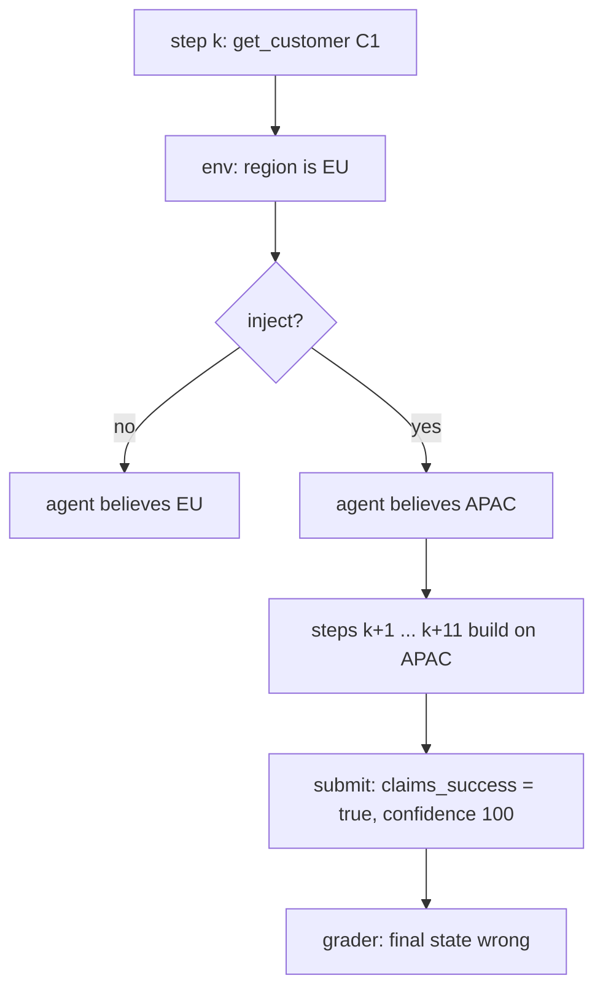

> Part of the series: [Six False-Greens: Field Notes from a Self-Auditing Agent Pipeline](/blog/six-false-greens-in-a-self-auditing-agent-pipeline)

# Same Model, 0% and 100%: Where the Verifier Gap Actually Lives

Trajectory T4, run 0. The agent read customer C1's record, got told the region was APAC when it was EU, and never asked again. Eleven tool calls later it submitted a regional rollup with 120.00 sitting in the wrong bucket, marked `claims_success: true`, and put its confidence at 100.

One trajectory out of 280. On its own it proves nothing, but it's the shape of what I spent two weeks and $2.43 measuring.

The claim under test was the one this whole series has circled: that agents are better at generating answers than at verifying them, so asking one to check its own work raises its confidence more than its accuracy. I built an experiment to falsify that. Then I built a second one because the first came back with the opposite answer, and I did not believe either of them until the two were sitting next to each other.

## Two numbers, one model

Experiment 1 put `deepseek-v4-flash` in front of a single piece of code and asked it whether the code was correct. Fifty of those pieces had a planted bug: a naive `line.split(",")`, a lexicographic version sort, an INNER JOIN that drops zero-order customers, `NOT IN` against a NULL. The model approved none of them. 0 of 50. Every rejection came with a repair, and all 50 repairs passed the asserts.

Experiment 2 put the same model in a twelve-step tool-calling loop and silently corrupted one tool result somewhere in the middle. Not an error or an exception, just a plausible, well-formed, wrong value. The model noticed 8 times out of 70. Of the 45 trajectories that ended with a wrong answer, 45 claimed success.

Side by side, single answer first, trajectory second:

- false-green rate: **0%** [0.0, 7.1], then **100%** [92.1, 100.0]
- caught the planted fault: 50 of 50, then 8 of 70
- the thesis: falsified, then supported

Brackets are Wilson 95% intervals. Same model, same temperature, same week, same laptop.

The gap between those two numbers is the finding. It's also the easiest thing here to overread.

## What experiment 1 actually showed

I expected a false-green rate of 25 to 40%. I had written that prediction down in RESEARCH.md before collecting anything, with a threshold of 15% and a falsification condition, because I've moved a threshold after seeing data before, and this series exists partly so I stop doing that.

The baseline generation arm came back at 98% pass@1. That was already a problem. With one wrong answer in fifty there was nothing for a verifier to be wrong about. So I tried making the tasks harder. A pilot on the hardened set scored 10 of 10, at three to thirty times the reasoning cost. One task went from 13k output tokens to 32k. The model did not make more mistakes when the task got harder. It thought longer.

I didn't expect that. Ninety-plus percent of this model's output on these tasks is reasoning tokens that never reach the response. In a sizing probe, a CSV parser cost 30,579 tokens of thought to produce 294 tokens of code. (The parser was correct.) On small, fully specified, self-contained problems, extended reasoning closes the generation gap almost entirely, and hardening the task just buys more thinking.

So I stopped tuning difficulty and added an arm where the wrong answers were supplied instead of generated: each task's documented buggy implementation, fenced the way the model fences its own output, placed in the assistant turn, with the identical verification prompt after it. That gave the false-green metric a denominator of 50 by construction.

And it caught all 50. I ran the numbers three times because I assumed the harness was broken. It was, several times, but never in that direction. That's its own post.

Four of five hypotheses were falsified by their own pre-registered thresholds. The fifth was undetermined, because you cannot average the confidence of false greens that do not exist.

## What experiment 2 changed

Experiment 1 had a substrate problem, and I only saw it clearly after it was over. "Write a function that parses CSV" is one call. No tools, no state, no steps. It is an LLM eval wearing an agent eval's clothes. Whether a model can review a diff was never the autonomy question. The question is whether "done" means anything after twelve steps.

So the second experiment is a small deterministic environment. Orders, customers, shipments, seven tools, all pure functions of an in-memory state I control. That last part is the design. Ground truth is computable at every step, not inferred from the outcome, because I know what every tool should have returned.

Into one tool result per trajectory I inject a silent failure. Four kinds.

- `list_orders` drops the last matching id
- `get_order` returns the status from before a write
- `sum_totals` omits the smallest item
- `get_customer` returns a neighbouring region

Every one of them is discoverable. There is a redundant route, `count_orders` beside `list_orders` and so on, and a gate proves before any run that a sequence of tool calls exists which exposes the corruption. Without that gate the experiment would be scoring an impossible task as agent failure, which would look like a strong result.

Detection has a mechanical definition. The agent detects the failure if, after the injection, it re-examines the same subject through a tool that would expose it. Same customer id, same filter, same set of ids. Not "called `get_customer` again," which is what I tried first and which counted the agent's ordinary progress through a customer list as suspicion. On the same data that definition reads 56%. The published 11.4% is what remains once "same subject" is required.

Contamination depth is how many tool calls ran on the poisoned value before anything noticed. Median 8. Maximum 21. The agent keeps acting on the bad number for most of the trajectory, then submits.

## What I got wrong

The prediction I was most confident about was that agents would notice a problem and still fail. Hypothesis 6, recovery under 60%. I had a whole paragraph drafted about how detection is necessary but not sufficient.

Recovery was 8 of 8. Every time the agent went back and re-read the corrupted subject, it went on to produce the right answer, sometimes after a couple of extra calls, but it got there. So the failure isn't that agents can't fix what they notice. It's that they almost never notice. That reframes what to build: not better repair, better suspicion.

The second miss was the per-step verification instruction. I added a line to the system prompt telling the agent to check that what it already knew was consistent before each tool call, and to resolve any contradiction before continuing. This is roughly what people ship. I predicted it would help a little at real cost, maybe 10 points of detection for 1.5x the tokens. It moved detection by +5.7 points at 1.03x. Free, and inside the noise. The hypothesis was falsified on the cost side, which I hadn't considered as a way to be wrong: an instruction to be careful is cheap because the model mostly doesn't act on it.

And the position comparison never happened. I wanted early versus late injections and the late ones fired 0 times in 32, because these agents fetch everything in the first turn or two and there is no later call to corrupt. That's a design defect on my side, I'll cover it separately, and the only thing I'll say here is that it's also a fact about the agents: the dangerous window is the start of a trajectory, since that's when data enters.

## Why the same model gives opposite answers

The tempting explanation is that verification is hard. But the first experiment says it isn't, not for this model. Reviewing ten lines of code that are in front of you is something it does well.

What is different in a trajectory is that nothing is in front of you. The corrupted value entered at step 3, got folded into a sum at step 6, the sum got compared to a threshold at step 9, and by step 12 the agent is looking at a submit payload that is internally consistent with everything it has seen. There's no diff to review. There's a belief, and the belief was wrong from the moment it formed, and every step since has been consistent with it.

So the checking is fine. By the time it runs there just isn't anything left to check against.

## What it cost, and what n is

Both experiments together came to 480 records and $2.43. About four hours of API time. The two weeks were mostly me getting the harness wrong, which is the next post. Experiment 1 was 200 records at $0.74. Experiment 2 was 280 trajectories at $1.69. In the final stage, 70 of 160 injections never fired because the agent never called the tool I was targeting, so the effective sample for detection is 70, not the 160 I planned.

That's a small n. The false-green interval is [92.1, 100] because 45 of 45 is a lot of agreement. The detection interval is [5.9, 21.0], and that's wide. I'd rather you read the interval than the point. Every rate in the repo carries its interval.

There's a larger caveat and it bothers me more than the sample size. In experiment 1, the verifier judged code it did not write. It had no stake in the answer. That is the favourable condition for a verifier, which makes the 0% a lower bound on the gap rather than evidence that self-verification is safe. Experiment 2 closes some of that distance, since the agent is judging its own trajectory, but the trajectory was corrupted by me rather than by the agent's own mistake. A model defending an answer it reasoned its way to might be worse still.

## FAQ

**What is the verifier gap?** The verifier gap is how much worse an LLM agent is at judging whether an answer is correct than it is at producing a correct answer in the first place. The claim is that models generate better than they verify, so self-verification inflates stated confidence more than actual accuracy. These two experiments found no gap when the model reviewed a single piece of code and a total gap when it reviewed its own multi-step trajectory.

**What is a trajectory false green?** A trajectory false green is a multi-step agent run that ends with a wrong final state while the agent's own structured submit payload claims success. In this experiment, 45 of 45 wrong trajectories were false greens. The agent's "done" signal carried no information about correctness.

**What is contamination depth?** Contamination depth is the number of tool-call steps an agent takes on a corrupted value before it re-examines the source or the trajectory ends. Here the median was 8 and the maximum 21, meaning the agent kept acting on bad data for most of a twelve-turn run.

**Why did the same model score 0% and 100%?** Because the two experiments asked it to verify different things. A single piece of code is fully present in the context window and can be re-read. A twelve-step trajectory's early state is not present as data; it is present as a belief formed several steps ago, and there is no diff to check it against.

**Why was the experiment pre-registered?** Every hypothesis threshold was written into the design document before any data was collected, with an explicit falsification condition, and a test asserts the thresholds in code still match the document. Four of experiment 1's hypotheses were falsified and two of experiment 2's were, which is the point: an experiment that cannot come back "no" is not measuring anything.

**What does this say about production agents?** Narrowly, that a per-step "check your work" instruction did not change detection in this setup, and that the dangerous window for a silent failure is the beginning of a trajectory rather than the end. Broadly, that an agent's self-reported success is not a signal you can gate an unattended action on, at least not on this model and this task class.

## The Transferable Lesson

Do not evaluate self-verification on a task where there is nothing to verify. A model that reviews ten lines of code and catches 50 of 50 bugs looks like it has solved the problem, and it has, for the ten lines. The failure lives in what isn't in front of the model: the value it read nine steps ago and has been building on since. If you want to know whether "done" means anything, corrupt something the agent will carry forward and count how many steps it carries it. Here the median was eight. T4 carried it for eleven, then submitted at confidence 100.

## In this series

- [Six False-Greens in a Self-Auditing Agent Pipeline](/blog/six-false-greens-in-a-self-auditing-agent-pipeline)
- [Permissive Parsing Is a False-Green Factory](/blog/permissive-parsing-is-a-false-green-factory)
- [One-Sided Contracts Break Agent Pipelines](/blog/one-sided-contracts-break-agent-pipelines)
- [QA Is Only as Honest as Its Coverage](/blog/qa-is-only-as-honest-as-its-coverage)
- [False Greens: Three Structural Observations](/blog/false-greens-three-structural-observations)
- [The Calibration Ledger: 58 Runs, 93% Pass, n Is Small](/blog/the-calibration-ledger-58-runs-93-pass-n-is-small)
- [The Arc Since the Six Were Caught](/blog/the-arc-since-the-six-were-caught)
- [Nine Times the Eval Tried to Lie to Me](/blog/nine-times-the-eval-tried-to-lie-to-me)

The experiments, raw records, and gates are public: [github.com/vitamin33/agent-eval-labs](https://github.com/vitamin33/agent-eval-labs).
