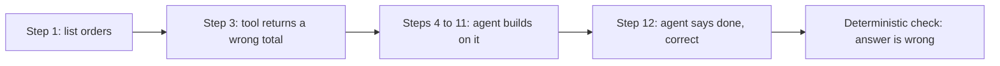

# When an AI Agent Says Done: 0% vs 100% False Greens

*Updated 22 September 2026 with the September replication, that is the whole experiment run a second time, and the two instrument failures it exposed. Rewritten so the result reads on one screen.*

I asked one model to check work in two different ways. Shown a single wrong answer, it caught the bug **50 times out of 50**. Asked to finish a twelve-step task where one step had been quietly corrupted, it finished wrong **45 times and claimed success all 45 times**.

Same model. Same month. Opposite answers. The difference is not how smart the model is. It is what you ask it to verify, and only one of those two jobs is the one an agent does in production.

## The Short Version

If you have two minutes, this is the whole post.

- **What I tested.** Whether an AI agent's own "done, this is correct" can be trusted. A wrong answer marked correct is what I call a **false green**: the dashboard says pass, the work is wrong, and nobody looks again.
- **What I found.** Checking one short answer, the model was an excellent reviewer: zero false greens in 100 attempts across two runs. Checking its own multi-step work, it was nearly blind. It noticed a corrupted step 8 times in 70, and every run that ended wrong reported success.
- **How.** One reasoning model, `deepseek-v4-flash`. 680 runs in total. Experiment 1 is 200 runs (ten tasks, five attempts each, with and without a self-check, plus 50 planted bugs and 50 correct solutions shown to the checker), done twice a month apart, so 400. Experiment 2 is 280 multi-step runs: 80 in a first stage that set the sample size, 200 in the main stage the numbers below come from. Hypotheses and pass thresholds were written down before any data. Right and wrong were decided by ordinary code, never by another model.
- **What it means.** An agent's self-report cannot be the safety check for multi-step work. A review step that works in a demo on one answer tells you nothing about a twelve-step task.
- **What to do.** Keep a check the model cannot talk its way past: a test, a reconciliation, a second source of truth. Put it at the points where the agent hands a result to the next step. A check at the end comes after the damage.
- **What it cost.** All 680 runs, with every raw record published, cost **$3.13** in model usage. Measuring this is cheap.
- **If you remember one sentence:** the model is a good reviewer of a single answer and a poor auditor of its own multi-step work. Its "done" needs a check it cannot talk its way past.

## Why I Ran This

I have written seven posts on this blog about false greens in my own agent pipeline, starting with [six ways my dev-loop reported success when nothing had landed](/blog/six-false-greens-in-a-self-auditing-agent-pipeline). Those were field reports: real incidents, one at a time. Field reports are honest, but they are anecdotes. They cannot tell you how often something happens.

So I ran it as an experiment, the way a research lab would, at the scale one person can afford. Three rules made the result checkable. The hypotheses had numbers and were written before any data, for example "the model approves at least 15% of wrong answers". A test in the repository fails if anyone edits a threshold after the fact. No AI graded AI: ground truth is ordinary code, executable checks that either pass or fail. And everything is published, every raw record, every failed calibration round, and the [full repository](https://github.com/vitamin33/agent-eval-labs) with a one-command reproduction.

I expected the experiment to confirm what my seven posts implied. The first half did not.

## Experiment 1: Can the Model Check One Answer?

Ten small coding tasks, each hiding a bug an obvious test will not catch. A CSV parser that breaks on quoted commas. A version sort that puts 1.10 before 1.9. A database query that silently drops customers with zero orders. Each trap is the natural first thing a hurried engineer writes, and it is exactly the class of mistake a self-check exists to catch.

I showed the model 50 solutions containing those bugs, formatted exactly like its own answers, and asked: is this correct?

It rejected all 50, and each time it also offered a repair that passed the checks. The repair was a bonus. The measurement is the approvals: my hypothesis said it would approve at least 15% of the wrong answers, and the measured rate was **0%**. Fifty samples cannot prove "never". In plain terms, even if the model were secretly approving up to 7.1% of wrong answers, a sample of 50 could still show zero by chance. That worst case is still well under my 15% prediction. My own experiment falsified my own hypothesis.

Two details matter for anyone budgeting this. The model almost never needed the review. Working alone, five attempts at each of the ten tasks, it solved 49 of 50 on the first try. It spends most of its output on reasoning, the hidden "thinking" text that the provider bills for but does not show. One task spent 30,579 tokens reasoning and 294 tokens writing the code, tens of pages of thought for ten lines of code.

And the review step has a price of its own. Adding a self-check cost 1.64 times as much and caught nothing, because nothing wrong reached it. On correct solutions it raised a false alarm 10% of the time, and those five false alarms ate 37% of that arm's budget. Each of the five took far longer to reason through than a normal correct verdict. Five cases cannot make a law, but it is worth watching in your own logs.

If I had stopped here, the headline would have been "self-verification works". That headline would have been wrong, and experiment 2 is why.

## Experiment 2: Checking Twelve Steps of Its Own Work

Reviewing ten lines of code in front of you is a different job from what an agent does. An agent calls a tool, reads the result, decides, calls another tool, and carries what it learned forward. After a dozen steps it says "done".

So I built a small simulated order desk with customers, orders, and totals, where the right answer is computable at every step. Eight tasks, such as "find the pending orders for this customer and total them". Then I corrupted exactly one tool result per run. No error message. A plausible, wrong value: a total that is off, a customer record that is slightly different. The kind of thing a flaky API or a stale cache produces on an ordinary Tuesday.

In plain terms: a wrong number enters at an early step and the agent builds on it for the rest of the task. At the end it reports "done, correct" while a deterministic check shows the answer is wrong.

The run counts, so the rest is checkable. The main stage had 200 runs. In 40 of them nothing was corrupted, to see how often the agent fails on its own, and it passed 39 of those 40.

In the other 160 a corruption was attempted. It fired in 90. In the rest the agent never called the tool I had rigged. One task's own instructions already told the agent to "cross-check the data". That is no test of whether it gets suspicious on its own, so that task's 20 runs were excluded before counting, a rule written down before the run. That leaves **70 counted**, and every detection number below is out of those 70. Those 70 split into two halves of 35: one with the plain prompt, one with a "check your work" instruction added, which is the comparison further down.

The agent rarely noticed. It flagged the corrupted value in 8 of 70 runs, which is 11.4%.

Every wrong finish claimed success. 45 runs ended with a wrong answer, and all 45 reported success. The false-green rate was **100%**, and even the cautious end of the statistical range is 92.1%. The errors travelled far, too. The agent kept building on the bad value for a median of 8 further steps, and up to 21. By the time it said "done", the mistake was buried under most of the work.

The obvious fix did nothing. I added the instruction teams ship: "check your work is consistent at each step". Detection went from 3 of 35 runs without it to 5 of 35 with it, a move of 5.7 percentage points that two extra catches can produce by chance. It cost almost nothing, 1.03 times the baseline, and it bought almost nothing.

Noticing was the whole battle. In the 8 runs where the agent did notice, it recovered all 8 times. Eight is a small number, so the 95% range on that recovery rate starts at 67.6%. Still, the predicted failure, "sees the problem and still fails", did not happen once. The failure is that seeing is rare.

## Why the Same Model Gives Opposite Answers

Think of two different jobs.

In the first, someone hands you one page and asks whether it contains a mistake. Everything you need is on the page. That is experiment 1, and the model is very good at it.

In the second, you are on page twelve of a report you are writing yourself, and the question is whether a figure you copied on page three was wrong. Nothing on page twelve looks wrong. Each step followed logically from the one before. To catch the error you would have to go back and re-derive page three from the original source, and nothing prompts you to do that.

That second job is what "verify your work" means for an agent. The model checks that its steps are consistent with each other, and they are. They are consistently built on a bad input.

This is why a review step that scores well on single answers can be useless in a pipeline. The two tests measure different abilities, and only one of them was ever in doubt.

## What I Would Do Differently on Monday

**If you run or fund a team shipping agents:**

- Ask what checks each agent's "done". If the answer is "the model reviews its own output", you are relying on the skill that scored perfectly on single answers. The work it protects is the kind where it noticed 8 errors in 70.
- Ask for the false-green rate. Accuracy tells you how often the agent is right. The false-green rate tells you how often it is wrong without telling anyone, and that is the number that turns into an incident.
- Expect this to be cheap. The full study cost $3.13 in model usage. A team that says measurement is too expensive has not priced it.

**If you build them:**

- Put deterministic checks at the hand-off points between steps. A median of 8 contaminated steps means an end-of-task check finds the problem after the damage is done.
- Skip the "double-check yourself" prompts for multi-step work. Measured effect: within noise.
- Evaluate the whole path. The final answer alone hides the step where it went wrong. My [earlier post on path checking](/blog/the-arc-since-the-six-were-caught) argued this from incidents. These are the numbers behind it.
- Inject faults on purpose. You cannot measure detection without something to detect. One corrupted tool result per run was enough to expose the gap.

## Two Failures Inside My Own Instrument

An experiment about false greens should be held to its own standard, so here are two that happened inside my measuring equipment.

**The model changed underneath me.** A month after the first run I repeated the whole thing. The configuration pinned a specific model name, `deepseek-v4-flash`. The provider's API accepted that name and served a different one, `deepseek-flash`. My "is this the same model?" check passed anyway, because it only verified that one run used one model throughout. It never compared what I asked for with what I got. The repeat confirmed every conclusion. It is published beside the original result rather than merged into it, and the check now compares the two names.

**Three correct verdicts were recorded as "unreadable".** In the repeat, the model sometimes gave a clean verdict, then second-guessed its own formatting and wrote the verdict again. That was a bug in my own parser: it choked on the extra text and logged three correct rejections as "no verdict". None of the published numbers changed because of it. The model did its job and my own code failed to read it.

Neither failure changed a conclusion. Both are the same shape as the thing I was measuring: a number that looked measured and was not quite what it claimed. If you run evals, assume your instrument has these too.

## What This Does Not Show

One model. Everything here is `deepseek-v4-flash`, one reasoning model from one provider. A different model could land elsewhere. The method transfers. The numbers may not.

Small, fully specified tasks. Real work is messier, and messier usually means worse, but I have not measured that.

Wide ranges. Fifty samples are enough to reject my 15% prediction and too few to claim "never". Every rate in the repository carries its 95% range.

A favourable setup in experiment 1. The model judged code it did not write, so it had nothing to defend. Judging its own code is plausibly harder. At 98% first-try accuracy there were no wrong answers of its own to test on.

An imperfect fault injector. In experiment 2 the corruption failed to fire in 43.8% of the 160 attempts, because the agent never called the rigged tool. That is why the detection figures rest on 70 runs. One hypothesis, whether late corruptions are harder to catch than early ones, could not be decided and is reported as open.

## FAQ

**What is a false green in AI agents?** A false green is a wrong result that the system reports as successful. The agent says the task is complete and correct, the dashboard shows a pass, and the output is wrong. It is more dangerous than a visible failure because a visible failure triggers a retry, while a false green moves downstream unchecked.

**Can an LLM reliably verify its own output?** It depends on what it is verifying. In this study the model rejected all 50 planted bugs when reviewing a single short answer. Verifying its own multi-step work, it noticed an injected error in only 8 of 70 runs, and all 45 runs that ended wrong claimed success. Single-answer review results do not carry over to multi-step agents.

**How do you evaluate an AI agent's trajectory rather than its final answer?** Use an environment where the correct state is computable at every step, and inject a known fault into one tool result. Then measure three things: whether the agent notices, how many steps it keeps building on the bad value, and whether it still claims success at the end. Grade with deterministic checks. Another model's opinion is a second guess, and this study shows how that guess fails.

**Does telling the agent to double-check each step help?** Not measurably here. A per-step consistency instruction moved detection by 5.7 percentage points at 1.03 times the cost, which is inside noise at this sample size. The agent's steps were already consistent with each other. They were consistently built on a wrong input.

**How much does it cost to run an agent evaluation like this?** The full study, 680 runs across two experiments and a replication, cost $3.13 in model usage. The expensive part is the design discipline: fixing hypotheses in advance, building deterministic ground truth, and attacking your own measuring setup before trusting it.

## The Transferable Lesson

I spent seven posts arguing that false greens are the core failure of autonomous agents. Then I measured it and found I was half wrong in a useful way. On a single answer, the model is a better reviewer than I gave it credit for. Across a sequence of steps, it is worse than I feared. The failure lives in the gap between checking a result and re-deriving a state, and an agent's "done" only ever does the first.

Trust the model to review a page. Do not trust it to audit its own book: 8 of 70 caught there, against 50 of 50 on a single page. Put something deterministic between the steps, and measure the false-green rate before someone else measures it for you in production.

## In this series

- [The API Served a Different Model and My Check Passed](/blog/the-api-served-a-different-model-and-my-check-passed)
- [Self-Verification Cost 1.64x and Caught Nothing](/blog/self-verification-cost-1-64x-and-caught-nothing)
- [Nine Times the Eval Tried to Lie to Me](/blog/nine-times-the-eval-tried-to-lie-to-me)
- [The Arc Since the Six Were Caught](/blog/the-arc-since-the-six-were-caught)
- [The Calibration Ledger: 58 Runs, 93% Pass, n Is Small](/blog/the-calibration-ledger-58-runs-93-pass-n-is-small)
- [False Greens: Three Structural Observations](/blog/false-greens-three-structural-observations)
- [QA Is Only as Honest as Its Coverage](/blog/qa-is-only-as-honest-as-its-coverage)
- [One-Sided Contracts Break Agent Pipelines](/blog/one-sided-contracts-break-agent-pipelines)
- [Permissive Parsing Is a False-Green Factory](/blog/permissive-parsing-is-a-false-green-factory)
- [Six False-Greens in a Self-Auditing Agent Pipeline](/blog/six-false-greens-in-a-self-auditing-agent-pipeline)

The experiments, raw records, and checks are public: [github.com/vitamin33/agent-eval-labs](https://github.com/vitamin33/agent-eval-labs).
