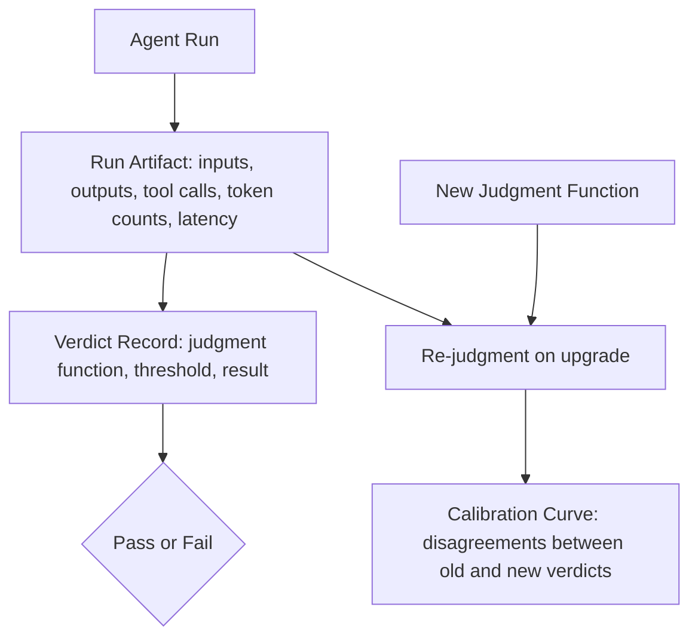

> Part of the series: [Six False-Greens: Field Notes from a Self-Auditing Agent Pipeline](/blog/six-false-greens-in-a-self-auditing-agent-pipeline)

# The Calibration Ledger: 58 Runs, 93% Pass, n Is Small

The calibration ledger holds ~58 runs at ~93% autonomous pass — and the most important thing I can tell you about that number is what it does not prove.

Most agent benchmarks collapse the moment you ask "how do you know the eval didn't lie?" I built an append-only ledger specifically to keep that question alive, and what I learned while building it is more useful than the number itself.

## Why an Agent Needs a Calibration Ledger

An agent that reports its own success is an agent you cannot trust. The failure mode is not dramatic — it is quiet. The agent completes a subtask, the output looks plausible, the downstream task proceeds, and the mistake propagates before anything triggers an alert. I call this a false green: a pass verdict issued by a judge or a metric that is measuring the wrong thing, at the wrong grain, or on a sample too small to be meaningful.

The calibration ledger is an append-only record of every autonomous run, the verdict it produced, and the judgment criteria that produced it. "Append-only" is not a buzzword here — it is a design constraint. A mutable log lets you quietly fix a bad run entry after the fact. An append-only log forces you to record corrections as new rows, which means the error rate is always visible in the history, not hidden by an edit.

At ~58 runs and ~93% autonomous pass, the ledger is real. It is also far too small to make a statistical claim like "false-green rate < 5%." The honest framing is *early evidence with an honest ledger*, not *proven reliability*. I want to be precise about that distinction because the entire value of keeping a ledger is that it does not let you cheat the framing.

## The Four Gaps I Know About

### Eval Depth Is Unit-Tier

The current eval stack is golden sets plus a dedup metric floor. That combination catches regressions on known inputs — it is a reasonable unit-test analog for agent behavior. What it does not catch is trajectory-level failure: the agent took a plausible-looking path, produced a plausible-looking output, and never triggered a golden-set mismatch, but the *sequence of decisions* was wrong in a way that will compound later.

Trajectory-level evals require judging intermediate states, not just final outputs. That means either a calibrated LLM-as-judge (which I do not have yet) or human review at every step (which does not scale solo). The integration-sink-per-feature pattern I use now — one integration test that exercises the full feature path and dumps structured output to a sink — is a first step toward feature-level proof. It is not the finish line.

A calibrated LLM-as-judge would let me score intermediate reasoning steps against a rubric, flag low-confidence judgments for human review, and accumulate a calibration curve over time. Without it, my eval depth has a ceiling. I know where the ceiling is. That is the point of the ledger.

### No Isolation or Sandbox

Runs happen on a live machine. There is a bypass flag in the trust gate — one logic mistake away from a real incident. This is not an acceptable permanent state; it is a deferred infrastructure cost that I am actively aware of. Proper sandboxing would mean ephemeral containers per run, network egress controls, and a clean-room file system that gets torn down after each eval. That infrastructure is future work, and naming it here is part of the honest accounting.

The risk profile of running on a live machine is not zero. I manage it with strict policy gating at the L0–L4 trust tiers — no action above a certain blast radius executes without an explicit human-in-the-loop checkpoint. But policy gating is a compensating control, not a substitute for isolation. The gap is real.

### Single-Author, Single-Codebase (Mostly)

The eval kit was just ported to a second repository. A smoke test proved the loop end-to-end in that new context — the core loop ran, the ledger recorded, the verdict fired. That is the beginning of a generalization claim. It is not a finished one.

Generalization in the eval sense means: does the calibration framework hold its properties when the underlying codebase, the agent topology, and the task distribution all change? One smoke test on one second repo answers: *it did not immediately break*. That is a meaningful data point. It is nowhere near sufficient evidence that the kit generalizes cleanly across arbitrary agent architectures.

I will keep porting it and keep running it. The ledger will accumulate. At some threshold of runs across multiple repos, the generalization claim becomes defensible. That threshold is not ~58.

### The Judge Problem

Every verdict in the ledger was produced by a judgment function — a metric, a golden-set match, or a heuristic check. None of those judges are themselves calibrated against a human ground truth at scale. That is the meta-problem: I am keeping an honest ledger of verdicts issued by judges whose false-green rate I do not yet know with statistical confidence.

This is not a reason to stop keeping the ledger. It is a reason to treat the ledger as a calibration instrument rather than a certification instrument. The ledger's job right now is to surface patterns — runs that cluster around specific failure modes, verdict distributions that shift when I change a prompt or a tool — not to issue a certificate of reliability.

## What the Ledger Actually Catches

Despite all of the above, the ledger earns its existence several times over, even at ~58 runs.

It caught a verdict function that was silently passing on empty output. The golden-set match short-circuited when the output string was empty because the match function returned true on a vacuous comparison. Without the append-only record and a manual audit of the verdict distribution, that bug would have accumulated false greens invisibly. The fix was one line of guard logic; finding it required the ledger.

It caught a prompt change that shifted the autonomous pass rate downward before the change was promoted. The ledger showed a cluster of fails in the new-prompt runs that was not present in the baseline runs. Without the historical record, I would have been comparing a mental model of past performance against observed current performance — unreliable. The ledger made the comparison concrete.

It keeps me honest in writing. I cannot claim "high reliability" in a post without the ledger immediately surfacing the actual number. That epistemic pressure is a feature.

## The Architecture Decision I Stand Behind

The design choice I am most confident about is the separation between the *run record* and the *verdict record*. Each run generates a structured artifact — inputs, outputs, tool calls, token counts, latency. The verdict is a separate record that references the run artifact and records which judgment function fired, what threshold it used, and what it returned.

This separation means I can re-judge historical runs when I upgrade a judgment function. If I deploy a calibrated LLM-as-judge tomorrow, I can run it against the existing ~58 run artifacts and see how its verdicts compare to the original verdicts. That is how I will eventually build the calibration curve for the judge itself — by accumulating disagreements between old and new judgment functions on the same underlying runs.

Without that separation, upgrading a judge destroys the historical comparison. You restart from zero. That is a compounding tax on every future improvement.

## The Honest Summary

~58 runs. ~93% autonomous pass. An append-only ledger. No isolation sandbox. Unit-tier evals without trajectory scoring. One successful smoke test on a second repo. A bypass flag that is one mistake from an incident. A judge calibration problem I have named but not solved.

That is the actual state. The strength of keeping a calibration ledger is not that it proves reliability — it is that it makes it structurally difficult to pretend reliability exists before it has been earned. Every false green the ledger catches is a failure that would otherwise have compounded silently. Every gap I name here is a gap I am not hiding behind a rounded-up metric.

The rarer, more useful story in agent engineering is not "look how reliable my agent is." It is "look how many ways an agent quietly lies about success, and what it takes to catch each one." The calibration ledger is the instrument for that second story.

## FAQ

**What is an agent calibration ledger?** An agent calibration ledger is an append-only log that records every autonomous run, the structured output it produced, and the verdict — pass or fail — issued by a defined judgment function. The append-only constraint ensures that bad verdicts cannot be silently deleted; corrections appear as new rows, keeping the full error history visible.

**What does "false green" mean in agent evals?** A false green is a pass verdict issued when the agent's output or trajectory was actually incorrect or incomplete. It happens when the judgment function measures the wrong signal — a vacuous string match, a metric that does not cover the failure mode, or a golden set that does not include the relevant edge case. False greens are dangerous because they accumulate silently and give a misleading picture of reliability.

**Why is ~58 runs not enough to claim a false-green rate below a given threshold?** Statistical claims about tail rates require large samples. At ~58 runs, the confidence intervals around any observed rate are wide enough that the true rate could be substantially higher than the observed rate. The honest framing at this sample size is "early evidence" — the ledger is accumulating signal, but it is not yet sufficient for a certified reliability claim.

**What is a fail-closed gate in an agent trust system?** A fail-closed gate is a policy checkpoint that defaults to blocking execution when the trust evaluation is ambiguous or fails. In my fleet, actions above a certain blast-radius threshold require an explicit human-in-the-loop approval; if that approval is not present, the action does not execute. This is the opposite of fail-open, where an ambiguous evaluation defaults to allowing execution.

**What would it take to add trajectory-level evals?** Trajectory-level evals require judging intermediate agent states, not just final outputs. The practical path is a calibrated LLM-as-judge that scores each decision step against a rubric, combined with a human review sample to build the calibration curve for the judge itself. Without that infrastructure, eval depth is capped at unit-tier — catching known-input regressions but missing compound reasoning failures that do not surface in final output.

## The Transferable Lesson

Keep the ledger before you need it. The calibration instrument has to predate the reliability claim — not follow it. If you build the ledger after you have already been telling people the agent is reliable, you have reversed the epistemic order and the ledger is now rationalization rather than evidence. Start append-only, name every gap explicitly, and let the number be whatever it actually is. ~58 runs at ~93% pass is an honest number. An honest number is the only kind worth keeping.

## In this series

- [Six False-Greens in a Self-Auditing Agent Pipeline](/blog/six-false-greens-in-a-self-auditing-agent-pipeline)
- [Permissive Parsing Is a False-Green Factory](/blog/permissive-parsing-is-a-false-green-factory)
- [One-Sided Contracts Break Agent Pipelines](/blog/one-sided-contracts-break-agent-pipelines)
- [The Arc Since the Six Were Caught](/blog/the-arc-since-the-six-were-caught)
- [QA Is Only as Honest as Its Coverage](/blog/qa-is-only-as-honest-as-its-coverage)
- [False Greens: Three Structural Observations](/blog/false-greens-three-structural-observations)
